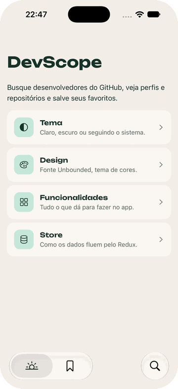

# DevScope

Aplicativo mobile para buscar desenvolvedores no GitHub, ver seus perfis e explorar seus repositórios. Feito com React Native, Expo e Redux Toolkit como solução para o desafio mobile da Desbravador.

## Sumário

- [Demo - Busca, perfil e repositórios](#demo---busca-perfil-e-repositórios)
- [Demo - Tema claro, escuro ou do sistema](#demo---tema-claro-escuro-ou-do-sistema)
- [Requisitos do desafio](#requisitos-do-desafio)
- [Além dos requisitos](#além-dos-requisitos)
- [Tecnologias](#tecnologias)
- [Como rodar](#como-rodar)
- [Testes e qualidade](#testes-e-qualidade)
- [Arquitetura](#arquitetura)
- [Limitações conhecidas](#limitações-conhecidas)

## Demo - Busca, perfil e repositórios

<table>
  <tr>
    <td width="300" align="center">
      
    </td>
    <td>
      <ol>
        <li>Busca de um usuário por nome ou login.</li>
        <li>Perfil com avatar, bio, seguidores, seguidos e o calendário de contribuições.</li>
        <li>Repositórios ordenados por estrelas, com o menu para mudar a ordem no topo.</li>
        <li>Detalhes de um repositório: descrição, tópicos, estrelas, forks, linguagem e data de atualização.</li>
        <li>Botão que abre o repositório no GitHub.</li>
      </ol>
    </td>
  </tr>
</table>

<br />

## Demo - Tema claro, escuro ou do sistema

<table>
  <tr>
    <td width="300" align="center">
      
    </td>
    <td>
      <ol>
        <li>Card <b>Tema</b> na Home, que abre um sheet nativo.</li>
        <li>Escolha entre <b>Sistema</b>, <b>Claro</b> e <b>Escuro</b>.</li>
        <li>A troca vale para o app inteiro, inclusive abas, cabeçalhos e menus nativos.</li>
      </ol>
    </td>
  </tr>
</table>

> 📱 Para abrir o app no Android ou no iOS pelo Expo Go, num aparelho físico ou no emulador, veja [Como rodar](#como-rodar).

## Requisitos do desafio

| # | Requisito | Onde está |
|---|---|---|
| 1 | Buscar um usuário do GitHub | Aba **Busca**, em [`search/index.tsx`](src/app/(app)/(tabs)/search/index.tsx) |
| 2 | Ver seguidores, seguidos, avatar, e-mail e bio | Tela de perfil, em [`UserProfileHeader.tsx`](src/features/users/components/UserProfileHeader.tsx) |
| 3 | Listar os repositórios por estrelas, em ordem decrescente | Ordenação padrão do perfil, em [`reposSlice.ts`](src/features/repos/store/reposSlice.ts) |
| 4 | Alterar a ordem da listagem | Menu **Ordenar por** no perfil: estrelas, forks, nome ou atualização, crescente ou decrescente |
| 5 | Ver os detalhes de um repositório com link para o GitHub | Toque em um repositório. Tela em [`repo/[owner]/[name].tsx`](src/app/(app)/repo/[owner]/[name].tsx) |

## Além dos requisitos

- **Busca com ordenação** por relevância, seguidores, repositórios ou data de cadastro.
- **Calendário de contribuições** do último ano no perfil, com skeleton enquanto carrega.
- **Favoritos** para salvar perfis e acessá-los por uma aba própria.
- **Compartilhamento** de perfis e repositórios pelo menu nativo do sistema.
- **Tema claro, escuro ou do sistema**, escolhido pelo usuário e aplicado no app inteiro.
- **Interface nativa:** abas, barra de busca, menus e sheets são componentes nativos de cada plataforma, com SF Symbols no iOS e Material Symbols no Android.
- **Estados de carregamento, vazio e erro** em todas as telas, inclusive o aviso de limite de requisições do GitHub com o horário de liberação.

## Tecnologias

| Tecnologia | Uso |
|---|---|
| [Expo SDK 57](https://docs.expo.dev) e React Native 0.86 | Base do app |
| [Expo Router](https://docs.expo.dev/router/introduction/) | Navegação baseada em arquivos, com rotas tipadas |
| [Redux Toolkit](https://redux-toolkit.js.org) e React Redux | Estado global organizado em slices |
| [RTK Query](https://redux-toolkit.js.org/rtk-query/overview) | Requisições à API do GitHub, com cache e deduplicação |
| TypeScript (strict) | Tipagem de todo o código |
| React Compiler | Memoização automática dos componentes |
| Reanimated | Animação do skeleton |
| Jest e jest-expo | Testes unitários |

## Como rodar

### Pré-requisitos

- [Node.js](https://nodejs.org) 22.13 ou mais recente
- Para a opção A, uma destas:
  - o app **Expo Go** num aparelho físico ([Android](https://play.google.com/store/apps/details?id=host.exp.exponent) · [iOS](https://apps.apple.com/app/expo-go/id982107779));
  - um emulador do **Android Studio**;
  - o simulador do iOS, que vem com o **Xcode** (somente macOS).
- Para a opção B: **Xcode** (somente macOS) para iOS, ou **Android Studio** com um emulador configurado para Android

### Instalação

```bash
git clone https://github.com/lemesvini/devscope.git
cd devscope
npm install
```

### Opção A: Expo Go (mais rápida)

```bash
npx expo start
```

**Num aparelho físico**, escaneie o QR code que aparece no terminal:

- **Android:** pelo app Expo Go.
- **iOS:** pela câmera do iPhone.

Celular e computador precisam estar na mesma rede Wi-Fi.

> Num iPhone físico, o Expo Go e o Expo CLI precisam estar logados na mesma conta Expo. Rode `npx expo login` no computador e entre com a mesma conta no Expo Go.

**Num emulador ou simulador**, com o servidor rodando, pressione no terminal:

- `a` para abrir no emulador Android, que precisa estar aberto no Android Studio;
- `i` para abrir no simulador do iOS (somente macOS).

O Expo CLI instala o Expo Go no emulador ou simulador automaticamente, se ainda não estiver instalado.

### Opção B: build nativo local

Compila o app nativo e abre no simulador ou emulador:

```bash
npx expo run:ios
npx expo run:android
```

Para instalar num aparelho conectado por cabo, adicione `--device`:

```bash
npx expo run:ios --device
npx expo run:android --device
```

> O primeiro build demora alguns minutos. As pastas `ios/` e `android/` são geradas automaticamente a partir do `app.json` e não ficam no repositório.

### Scripts disponíveis

| Comando | O que faz |
|---|---|
| `npm start` | Inicia o servidor de desenvolvimento |
| `npm test` | Roda os testes |
| `npm run test:watch` | Roda os testes em modo observação |
| `npm run typecheck` | Verifica os tipos com o TypeScript |
| `npm run lint` | Roda o ESLint |

## Testes e qualidade

```bash
npm test
npm run typecheck
npm run lint
```

Os testes cobrem a lógica do app que não depende de tela:

- ordenação dos repositórios;
- os slices do Redux (repositórios, busca, favoritos e tema), incluindo o listener que aplica o tema;
- a conversão dos erros da API do GitHub, como o limite de requisições, em mensagens para o usuário.

## Arquitetura

```text
src/
├── app/                  Rotas (Expo Router). Cada arquivo é uma tela
│   └── (app)/
│       ├── (tabs)/       Abas: Home, Busca e Favoritos
│       ├── user/         Perfil do usuário
│       ├── repo/         Detalhes do repositório
│       └── about/        Sheets dos tópicos da Home
├── features/             Código organizado por funcionalidade
│   ├── about/            Cards e conteúdo da Home
│   ├── repos/            Cards, slice de ordenação e função de ordenar
│   ├── search/           Slice de ordenação da busca
│   ├── settings/         Slice de tema, listener e seletor de tema
│   └── users/            Cards, cabeçalho do perfil, calendário e favoritos
├── lib/
│   ├── github/           API do GitHub com RTK Query, tipos e tratamento de erros
│   └── store/            Configuração da store e hooks tipados
└── theme/                Cores, fontes e hooks de tema e ícones
```

**Rotas e telas.** A pasta `src/app` contém só as rotas. Os componentes, slices e utilitários ficam em `src/features`, agrupados pela funcionalidade a que pertencem.

**Estado.** A store tem um slice por funcionalidade:

| Slice | Responsabilidade |
|---|---|
| `githubApi` | Requisições ao GitHub com RTK Query: cache por argumento, deduplicação e estados de carregamento e erro |
| `repos` | Critério e direção de ordenação dos repositórios |
| `search` | Ordenação dos resultados da busca |
| `favorites` | Perfis salvos |
| `settings` | Preferência de tema, aplicada por um listener middleware |

**Busca.** A aba Busca usa o endpoint de busca do GitHub (`/search/users`), que encontra usuários por nome ou login. Ao tocar em um resultado, o perfil completo vem de `/users/{username}`.

**Ordenação dos repositórios.** O endpoint `/users/{username}/repos` não ordena por estrelas, então a ordenação acontece no app, a partir da lista retornada.

## Limitações conhecidas

- **Limite de requisições do GitHub.** Sem autenticação, a API permite 60 requisições por hora e 10 buscas por minuto. Quando o limite é atingido, o app mostra o horário de liberação.
- **E-mail.** A API só retorna o e-mail quando o usuário o deixou público no GitHub.
- **Repositórios.** São carregados até 100 repositórios por usuário.
- **Calendário de contribuições.** A API pública do GitHub não fornece esse dado, então ele vem de um serviço de terceiros ([github-contributions-api](https://github.com/grubersjoe/github-contributions-api)).

## Autor

**Vinicius Lemes** · [GitHub](https://github.com/lemesvini)
